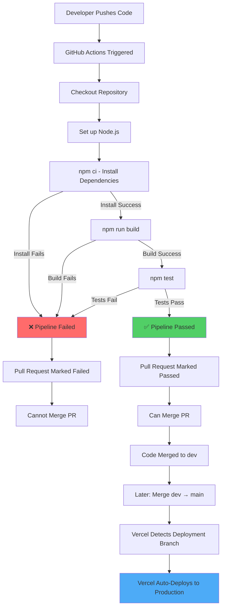

# CI/CD Pipeline Documentation

## What is CI/CD?

**CI/CD** stands for **Continuous Integration/Continuous Deployment**. It is an automated workflow that:

- **Continuous Integration (CI)**: Automatically builds and tests the code whenever changes are pushed or a pull request is opened. This catches bugs early and ensures code quality.
- **Continuous Deployment (CD)**: Automatically deploys the application to production when tests pass and code is merged to the deployment branch.

For the Eventive project, CI automatically validates that:
1. All dependencies install correctly
2. The application builds successfully
3. The test suite passes completely

## GitHub Actions Workflow File

**Location**: `.github/workflows/ci.yml`

This is the configuration file that defines the automated CI pipeline. It is written in YAML format and tells GitHub Actions what to do whenever code is pushed or a pull request is opened.

## Pipeline Commands

The CI pipeline runs the following commands in order:

```bash
# Install dependencies (with clean install)
npm ci

# Build the application
npm run build

# Run the test suite
npm test
```

### Command Details

| Command | Purpose |
|---------|---------|
| `npm ci` | **Clean Install** - Installs exact dependency versions from `package-lock.json` (preferred for CI environments) |
| `npm run build` | Builds the production bundle using Vite, creating optimized assets in the `dist/` directory |
| `npm test` | Runs the test suite using Vitest, validating all unit tests pass |

## What Happens If Tests Fail

If any step fails (install, build, or tests), GitHub Actions:

1. **Stops execution** - Subsequent steps do not run
2. **Marks the pipeline as failed** ❌
3. **Blocks the pull request** - GitHub prevents merging until the pipeline passes
4. **Sends notifications** - The developer receives feedback through:
   - GitHub pull request status checks
   - Email notifications (configurable)
   - GitHub Actions dashboard

**Example failure scenarios:**
- A test assertion fails: `npm test` returns exit code 1
- Build errors exist: `npm run build` fails to compile
- Missing dependencies: `npm ci` cannot resolve imports

## What Happens If the Build Fails

Build failures are caught immediately by the `npm run build` step:

1. **Error message is logged** - Vite displays the specific error (syntax, import, config issue, etc.)
2. **Pipeline stops** - Tests are not run
3. **PR is marked failed** - Cannot be merged
4. **Developer must fix** - Correct the issue, push a new commit, and the pipeline automatically re-runs

## Vercel Deployment Integration

### How Vercel Connects to GitHub

Vercel automatically deploys your application when:
1. Code is **pushed to a specific branch** (typically `main` or `production`)
2. The code is merged after CI/CD passes

**Note:** Vercel deployment is **separate from GitHub Actions**. GitHub Actions validates the code works; Vercel handles the actual hosting and deployment.

### Recommended Branch Flow

The team should follow this workflow for safe, automated deployments:

```
1. Developer pushes to feature branch (e.g., natalyn)
                    ↓
2. Open Pull Request into dev
                    ↓
3. GitHub Actions CI runs automatically
   - Installs dependencies
   - Builds the app
   - Runs tests
                    ↓
4a. If CI FAILS ❌
    - PR is blocked
    - Developer fixes issues
    - Pushes new commit
    - CI re-runs automatically
                    ↓
4b. If CI PASSES ✅
    - PR can be merged into dev
    - Code is merged to dev branch
                    ↓
5. Later: Merge dev → main
   - Vercel detects the push to main
   - Vercel deploys to production
```

### Vercel Configuration Checklist

Before deployment, confirm:

- [ ] **Which branch does Vercel deploy from?** (Usually `main`)
- [ ] **Is Vercel configured to deploy on every push?** (Yes)
- [ ] **Does Vercel run build checks before deployment?** (Should be yes)
- [ ] **Are environment variables set in Vercel?** (If needed for the app)

To verify Vercel settings:
1. Go to your Vercel project dashboard
2. Navigate to **Settings** → **Git**
3. Check the **Production Branch** setting
4. Confirm auto-deploy is enabled

## CI/CD Pipeline Flow Diagram



## Testing Strategy

The test suite validates critical functionality:

- **Search by exact name** - Returns the correct guest
- **Search by partial name** - Returns matching results
- **Case-insensitive search** - Handles all name variations
- **Search by company** - Filters by company name
- **Correct table mapping** - Assigns the right table number
- **Empty results** - Handles non-existent guests gracefully
- **Empty input** - Handles blank searches
- **Result limits** - Respects maximum result count

All tests must pass before code can be merged.

## Monitoring the Pipeline

### View Pipeline Status

1. **On Pull Requests**: Check the status checks section in the PR
2. **On GitHub Actions tab**: View detailed logs of each step
3. **In your code editor**: Some editors show CI status in the UI

### Debugging Failed Pipelines

If the pipeline fails:

1. Click the failed status check
2. Go to **Details** → View the GitHub Actions run
3. Expand the failed step to see the error message
4. Fix the issue locally first
5. Push a new commit to the same branch
6. GitHub Actions automatically re-runs

## Summary

| Component | Purpose | Location |
|-----------|---------|----------|
| **GitHub Actions Workflow** | Defines CI pipeline | `.github/workflows/ci.yml` |
| **npm ci** | Install exact dependencies | Runs in CI only |
| **npm run build** | Build production bundle | Creates `dist/` folder |
| **npm test** | Run test suite | Tests search, UI, logic |
| **Vercel** | Host and deploy app | Connected to GitHub repo |
| **Main branch** | Production code | Triggers Vercel deployment |
| **Dev branch** | Staging code | Receives PRs, used for testing |

Once a pull request is merged to the deployment branch and Vercel detects it, the application is automatically deployed to production with zero downtime.
